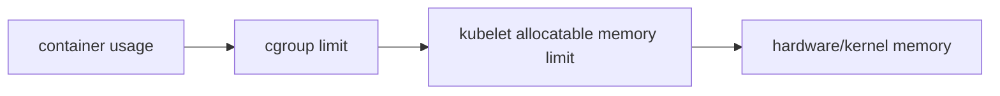

## 引言
最近在微信上看到一些关于 OOM 的文章和评论，发现大家对于 Kubernetes 内的 OOM 有很多混淆，所以想整理一下，写篇博客。

- **问题场景**：在 Kubernetes 中，Pod 因内存问题被终止的现象频繁发生，但具体原因可能不同。
- **核心疑问**：同样是内存不足，为何会有不同机制触发？如何区分日志中的 `Evicted` 和 `OOMKilled`？
- **文章目标**：通过对比三种内存终止机制，帮助读者快速定位问题根源。

---

## 一、Kubernetes 内存管理基础

### 1.1 内存资源的两层限制
- **节点级（Node Level）**：物理内存总量与 `kubelet` 的资源预留。
- **Pod 级（Pod Level）**：通过 `resources.limits.memory` 设置 cgroup 限制。

### 1.2 内存压力的传递链条

## 二、三种 OOM 机制

### 2.1 机制一：cgroup 的精确打击
触发条件

* Pod 内存用量超过 limits.memory（usage_in_bytes）

行为特征

* 容器运行时（如 containerd）强制终止
* 无差别处决：直接杀死超限 Pod，与 Pod 优先级 / QoSClass / oom_score_adj 都无关
* 日志表现：Pod  container status 中会显示 OOMKilled，但节点内存可能充足

典型场景

* limits 填小了（如 limits = 实际需求 + 30%）
* working_set 可能掩盖真实内存压力

建议根据 prometheus 监控的数据来判断需要设置多少 memory limit，很多人可能看到 kubelet 用 working_set 来做 evict 就认为所有的 OOM 都与 working set 有关，实际上 cgroup 并不知道有 working_set 这个东西。这是 cAdvisor / kubelet 领域里制造出来的。所以请不要用 working_set 来判断 memory limit 该填多少，使用 usage_in_bytes。

见：

* https://kubernetes.io/docs/concepts/scheduling-eviction/node-pressure-eviction/#memory-signals

### 2.2 机制二：kubelet node pressure eviction
触发条件

* 硬驱逐（Hard Eviction）：memory.available < 100Mi
* 软驱逐（Soft Eviction）：阈值 + graceful period

行为特征

* 驱逐策略：基于 Pod 优先级和 QoS（BestEffort 优先被驱逐）
* 资源计算：memory.available := node.status.capacity[memory] - node.stats.memory.workingSet
* 日志表现：pod events 中显示 Evicted 事件

典型场景

* Pod 没设置 limit 并且使用大量内存，节点内存不足
* 未正确预留 kube-reserved 导致系统资源争抢

尽管 kubelet 通过监控内存压力尝试预防 OOM，但其默认轮询机制存在固有延迟。当内存使用量急速上升时（如应用突发内存分配），kubelet 可能未及时感知压力，内核已判定内存耗尽并启动 OOM Killer。

但 kubelet 有对应参数获取实时的 mem notification。并且由于缓存是可以被回收的，所以 kubelet 通过 working set 来判断已耗尽的内存，而不是直接使用 memory.usage_in_bytes。

见：

* https://kubernetes.io/docs/concepts/scheduling-eviction/node-pressure-eviction/#kubelet-may-not-observe-memory-pressure-right-away

### 2.3 机制三：kernel OOM Killer
触发条件

* 节点全局内存耗尽（包括非容器进程）

行为特征

* 评分机制：内核通过 oom_score 选择牺牲者。oom_score_adj 越低，oom_score 越低
* 绕过 Kubernetes：可能杀死系统进程或高内存容器，但是 kubelet 会对不同 QoS class pod 设置不同 oom_score_adj
* 日志表现：dmesg 或 /var/log/messages 中的 Killed process 记录

典型场景
* Pod 没设置 limit 并且疯狂使用内存

见：

* https://kubernetes.io/docs/concepts/scheduling-eviction/node-pressure-eviction/#node-out-of-memory-behavior

## 三、Memory QoS

在 k8s 世界内，oom 是个很常见的问题，cgroup v2 通过引入 memory.min 参数优化了内存分配机制，与 v1 仅依赖 memory.limit 不同，v2 引入了 `mem.min`，v2 可确保 Pod 至少获得 request 声明的内存配额，但由于内存不具备类似 CPU 的时间片调度能力，一旦超额使用仍只能依赖 OOM Kill 机制回收资源。这种设计使得在内存紧张时，OOM Kill 可能比 v1 环境下更为频繁。

尤其是在 sidecar 场景，由于 kubelet 在计算容器的 oom_score_adj（OOM 优先级评分）时，不仅参考 QoS 类型，还与 memory.request 成反比。导致使用 sidecar 时，于 sidecar 容器通常配置极小的 memory.request（或者不配置），其 oom_score_adj 值往往显著高于业务容器。当节点内存不足时，这类低优先级容器会率先成为 OOM Kill 的牺牲品，进而导致 Sidecar 模式的服务稳定性风险。

有兴趣的读者可以阅读：

* https://kubernetes.io/blog/2023/05/05/qos-memory-resources/
* https://github.com/kubernetes/kubernetes/issues/111356
